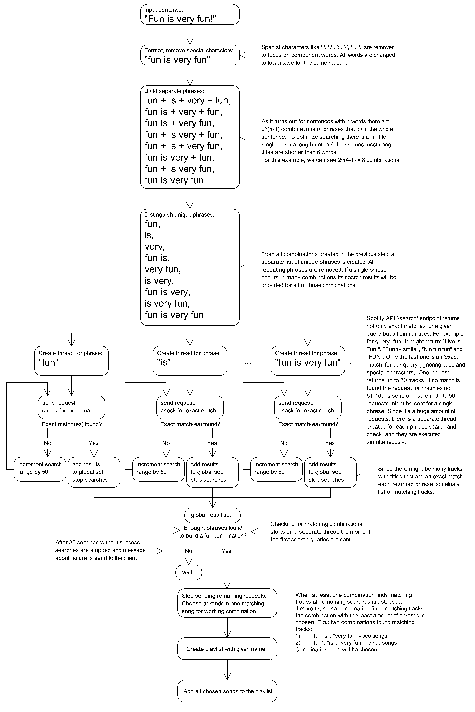

# SpotifyFun

The application lets you create Spotify Playlist based on the given sentence.
For every phrase in said sentence (including single and multiple words per phrase), a matching song will be searched.
If a combination of songs, whose titles can be read as input sentence, is found - it will be added to the user's Spotify account as a new playlist.
Works best with the English language.

Application is build with Java 17 and SpringBoot 3.1.

Current version: <b>0.0.3</b>

## Run the app
To run the application user have to clone the repository on the machine that has installed Java JRE (version at least 17).
Then you have to create a file "spotify-secret" that contains the Spotify app secret, which will be loaded and sent with OAuth requests.
Then you can run the following commands from the console opened in the project directory:

<b>Windows:</b>

    gradlew.bat
    gradlew clean build
    java -jar ./build/libs/SpotifyFun.jar

<b>Linux:</b>

    ./gradlew clean build
    java -jar ./build/libs/SpotifyFun.jar

Log '<b>Started SpotifyFunApplication</b>' indicates successful start of the application.

All requests can now be passed to url

    http://localhost:9090/

Port has to match one specified in the Spotify Application.

# REST ENDPOINTS

## Get access token

### Request

`GET api/v1/auth/login`

    curl -i -H 'Accept: application/json' http://localhost:9090/api/v1/auth/login

### Response 
Will redirect to Spotify Login page to retrieve OAuth2 token. After successful login app will go to result page:

`GET api/v1/auth/login`

### Response - successfully logged into Spotify

    HTTP/1.1 200 OK
    Content-Type: application/json
    {
        "access_token":"<TOKEN_STRING>",
        "refresh_token":"<REFRESH_TOKEN_STRING>",
        "expires_in":<EXPIRATION_TIME_IN_SECONDS>,
        "scope":"playlist-modify-public"
    }

## Generate playlist

### Request

`POST api/v1/playlist/new`

    curl -X POST -i 
        -H 'Content-Type: application/json' 
        -d '{
                "name":"<PLAYLIST_NAME>",
                "sentence":"<INPUT_SENTENCE>",
                "token":"<TOKEN_RETURNED_FROM_AUTH_ENDPOINT>"
            }'
        http://localhost:9090/api/v1/playlist/new

### Response - matching songs found and playlist is created
Will return the newly created playlist URL. User can use it to display the playlist in a web browser,
or can check the playlist directly in Spotify Application (if the same user is logged in):

`GET api/v1/auth/login`

    HTTP/1.1 201 CREATED
    Content-Type: application/json
    {
        "playlist":"<GENERATED_PLAYLIST_URL>"
    }

### Response - any problem with request processing
HTTP/1.1 400/401/429/422
    Content-Type: application/json
    
    {
        "Error message": "<MESSAGE_WITH_PROBLEM_SOURCE_EXPLANATION>"
    }

# Algorithm explanation
Flow of the application algorithm is explained on the following diagram:
